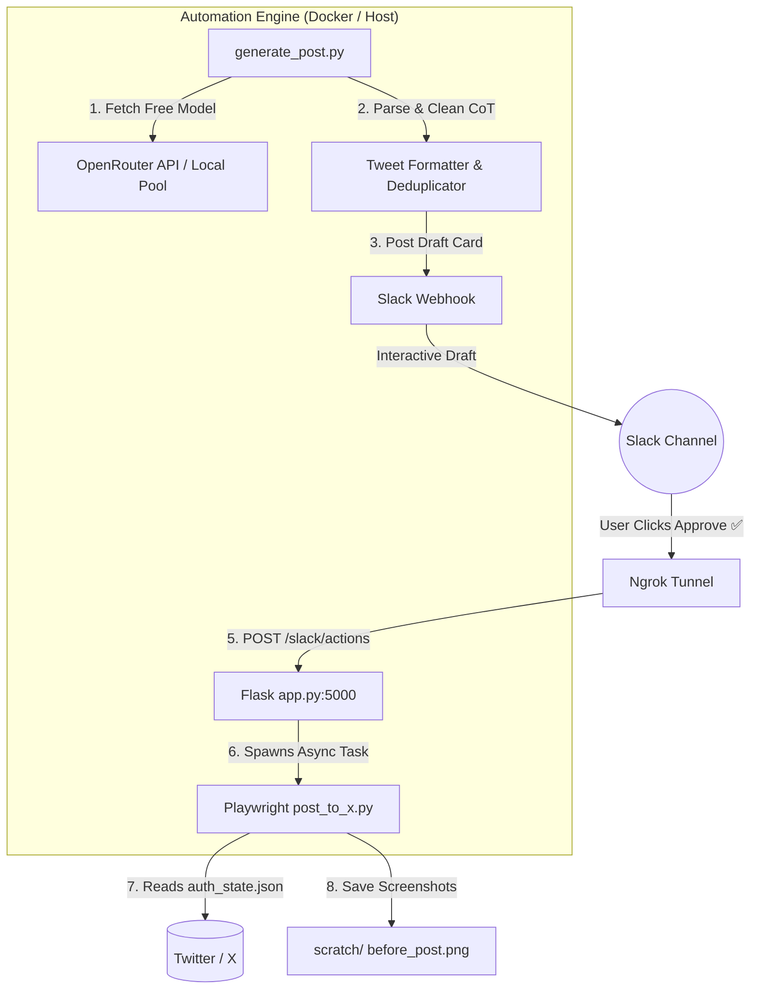

# 🤖 Twitter (X) Automation Engine with AI, Slack & Playwright

[](https://www.python.org/)
[](https://playwright.dev/python/)
[](https://www.docker.com/)
[](https://api.slack.com/block-kit)
[](https://openrouter.ai/)

An end-to-end, automated social media pipeline that generates AI-driven tech/AI tweets via **OpenRouter Free LLMs**, sends interactive approval draft cards (**Approve ✅** / **Reject ❌**) to **Slack**, and automatically posts approved tweets directly to **Twitter (X)** using Playwright headless browser automation—**zero paid Twitter API required!**

---

## ✨ Key Features

- 🧠 **AI-Powered Tweet Generation**: Leverages OpenRouter API with dynamic free LLM model selection (`google/gemma-4-31b-it:free`, `minimax/minimax-m3:free`, etc.) across diverse tech & AI topics.
- 🧹 **Chain-of-Thought (CoT) Filtering**: Smart parser automatically strips out internal LLM reasoning/thinking tags (`<think>...`) and extracts clean, 280-character ready-to-post tweets with hashtags.
- 🛡️ **Duplicate Prevention**: Keeps persistent history (`posted_history.json`) to guarantee no repeat tweets are generated or posted.
- 💬 **Interactive Slack Approval Workflow**: Sends rich Slack Block Kit cards with one-click **Approve ✅** and **Reject ❌** buttons.
- 🌐 **Seamless Tunneling**: Integrated **Ngrok** tunnel exposes the Flask webhook endpoint for Slack interactive button callbacks without manual port forwarding.
- 🎭 **Zero-API Twitter Posting**: Uses Playwright Chromium with saved session state (`auth_state.json`) or cookie injection (`X_AUTH_TOKEN`) to bypass expensive API pricing.
- 🐳 **1-Command Docker Deployment**: Ready-to-use `docker-compose` setup bundles Flask, Ngrok, Playwright, and scheduled background generator loops into a single container.
- ⏱️ **Flexible Linux Systemd Setup**: Optional systemd service and timer files included for host-native background execution.

---

## 🏗️ Architecture & Workflow



---

## 📂 Project Structure

```text
twitter-automation/
├── app.py                  # Flask server handling Slack interactive button actions (/slack/actions)
├── generate_post.py        # AI tweet generator with OpenRouter dynamic models & CoT cleaning
├── post_to_x.py            # Playwright browser automation script for posting to Twitter (X)
├── send_to_slack.py        # Slack Block Kit message builder and webhook caller
├── login_x.py              # Interactive utility to log into Twitter and export auth_state.json
├── auth_state.json         # Saved browser cookies for headless Playwright sessions
├── posted_history.json     # Saved history of posted tweets to prevent duplicates
├── Dockerfile              # Playwright + Ngrok + Python base Docker image
├── docker-compose.yml      # Docker Compose configuration for 1-command startup
├── docker-entrypoint.sh    # Multi-service entrypoint script (Flask + Ngrok + generator loop)
├── setup_systemd.sh        # Installer script for Linux systemd user timers
├── run_services.sh         # Native host service runner script
├── run_generator.sh        # Native host generator runner script
├── .env.example            # Environment variable template
├── systemd/                # Systemd service and timer unit files
│   ├── twitter-generator.service
│   └── twitter-generator.timer
└── scratch/                # Automatic diagnostic screenshots (before_post, after_post, errors)
```

---

## ⚙️ Quick Start Guide

### Prerequisites

- **Docker & Docker Compose** installed (for containerized deployment) *OR* **Python 3.10+** (for native deployment).
- A **Slack Workspace** with incoming webhooks and interactive components enabled.
- An **Ngrok account** (free tier is fine).
- A **Twitter (X) account**.

---

### Step 1: Environment Configuration

Create a `.env` file in the project root based on `.env.example`:

```bash
cp .env.example .env
```

Configure your parameters in `.env`:

```env
# Slack Webhook URL for draft notifications
SLACK_WEBHOOK_URL="https://hooks.slack.com/services/YOUR/WEBHOOK/URL"

# Ngrok Configuration
NGROK_DOMAIN="your-ngrok-domain.ngrok-free.dev"
NGROK_AUTHTOKEN="your_ngrok_authtoken"

# Generator Schedule Interval (in hours)
GENERATE_INTERVAL_HOURS=1

# OpenRouter AI Configuration (Free LLMs)
OPENROUTER_API_KEY="sk-or-v1-YOUR-OPENROUTER-KEY"
OPENROUTER_MODEL="openrouter/free"

# Optional Direct Cookie Auth (Alternative to login_x.py)
# X_AUTH_TOKEN="your_x_auth_token_cookie"
```

---

### Step 2: One-Time Twitter (X) Authentication

To allow Playwright to post on your behalf without manual logins:

#### Method A: Interactive Browser Login (Recommended)

Run `login_x.py` locally once to authenticate and save session cookies:

```bash
# Create and activate virtual environment
python3 -m venv venv
source venv/bin/activate
pip install -r requirements.txt

# Run login helper
python login_x.py
```

> 🌐 A Chromium window will open. Log into your X account. Once logged in and on the homepage, press **Enter** in your terminal.
> This writes your session state into `auth_state.json`.

#### Method B: Environment Cookie Injection

If running in headless-only environments, copy your `auth_token` cookie value from Chrome Developer Tools (`F12` -> `Application` -> `Cookies` -> `https://x.com`) and add it to `.env`:

```env
X_AUTH_TOKEN="your_extracted_auth_token_value"
```

---

### Step 3: Configure Slack Interactive Webhook

1. Go to [Slack API Apps](https://api.slack.com/apps) and select your application.
2. Under **Interactivity & Shortcuts**, turn **Interactivity ON**.
3. Set the **Request URL** to your Ngrok endpoint:
   `https://<your-ngrok-domain>.ngrok-free.dev/slack/actions`
4. Click **Save Changes**.

---

### Step 4: Run the Application

#### Option 1: Docker Deployment (Recommended - 1 Command)

Start all services (Flask app, Ngrok tunnel, and background tweet generator):

```bash
docker-compose up --build -d
```

Check live logs:

```bash
docker-compose logs -f
```

What happens on start:
1. Starts **Flask Webhook Server** on port `5000`.
2. Establishes the **Ngrok Public Tunnel**.
3. Runs an **initial tweet generation** immediately and posts the draft card to Slack.
4. Schedules recurring generation every `GENERATE_INTERVAL_HOURS` (default: 1 hour).

---

#### Option 2: Native Linux Host / Systemd Timer

If you prefer running natively on Linux with systemd:

1. **Start Flask & Ngrok services**:
   ```bash
   chmod +x run_services.sh run_generator.sh setup_systemd.sh
   ./run_services.sh
   ```

2. **Install systemd timer for hourly tweet generation**:
   ```bash
   ./setup_systemd.sh
   ```

3. **Check timer status**:
   ```bash
   systemctl --user status twitter-generator.timer
   ```

---

## 🕹️ Interactive Workflow

1. **Generation**: The bot generates an engaging AI tech tweet and posts a card to your Slack channel:
   
   > 🤖 **Generated Tweet:**
   > *AI agents are transitioning from simple chat interfaces to autonomous entities capable of reasoning, planning, and tool use. #AIAgents #GenAI #FutureOfWork*
   >
   > [ **Approve ✅** ]  [ **Reject ❌** ]

2. **Approval**: When you click **Approve ✅**:
   - Slack sends a request to `POST /slack/actions`.
   - Flask triggers Playwright in a non-blocking background thread.
   - Headless Chromium opens `x.com/compose/post`, inputs the tweet text, clicks **Post**, and saves verification screenshots in `scratch/`.
   - The tweet text is saved into `posted_history.json` to prevent duplicates.

3. **Rejection**: When you click **Reject ❌**, the draft is safely discarded.

---

## 🛠️ Management Commands Reference

| Action | Command | Description |
| :--- | :--- | :--- |
| **Start (Docker)** | `docker-compose up --build -d` | Launches all containerized services in background |
| **Stop (Docker)** | `docker-compose down` | Gracefully terminates all containerized services |
| **View Logs (Docker)** | `docker-compose logs -f` | Streams real-time logs for Flask, Ngrok & Generator |
| **Manual Generation** | `./venv/bin/python generate_post.py` | Generates a single tweet draft and sends to Slack immediately |
| **Re-Authenticate X** | `./venv/bin/python login_x.py` | Launches GUI browser to update `auth_state.json` |
| **Systemd Status** | `systemctl --user status twitter-generator.timer` | Displays status of native systemd timer |

---

## 🔍 Verification & Diagnostics

During every posting attempt, the system automatically captures step-by-step full-page screenshots stored in the [scratch/](file:///home/ravi/Desktop/Study%20Material/Projects/Personal/twitter-automation/scratch) directory:
- `scratch/before_post.png`: Captures the tweet in the compose box prior to clicking Post.
- `scratch/after_post.png`: Captures the published status after posting.
- `scratch/not_logged_in.png`: Generated if Twitter session expired or authentication is needed.

---

## 📄 License

Distributed under the MIT License. See `LICENSE` for details.
