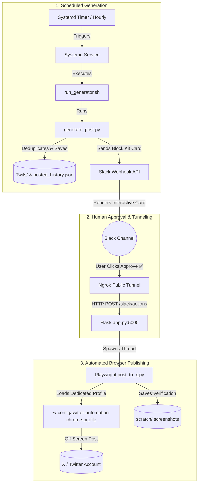

# 🤖 Twitter (X) Automation Workspace

[](https://www.python.org/)
[](https://playwright.dev/python/)
[](https://flask.palletsprojects.com/)
[](https://freedesktop.org/wiki/Software/systemd/)
[](https://api.slack.com/)

An end-to-end autonomous pipeline designed to generate curated AI insights, deliver interactive draft cards to Slack for human review (with **Approve ✅** and **Reject ❌** buttons), and automatically publish approved posts to X (Twitter) using persistent off-screen browser sessions.

---

## 📌 Features

- 🧠 **AI Content Generation**: Dynamically selects unique topics and variations from a curated post pool without duplicating past content.
- 💬 **Interactive Slack Approval**: Sends rich Slack Block Kit cards featuring direct approval buttons.
- ⚡ **Background Action Processing**: Flask server receives Slack webhooks and handles posting asynchronously in separate threads to avoid Slack timeout issues.
- 🌐 **Ngrok Public Tunnel**: Routes external Slack interactivity webhooks seamlessly to local listener.
- 🎭 **Off-Screen Playwright Automation**: Uses a dedicated Chrome profile context (`~/.config/twitter-automation-chrome-profile`) to post to X without requiring open desktop browser interaction or re-authentication.
- ⏰ **Systemd Timer Scheduling**: Runs headlessly on a scheduled timer (default: hourly) via Linux user systemd units.
- 📸 **Automated Diagnostics**: Captures pre-posting and post-posting screenshots (`scratch/`) and maintains post history (`posted_history.json`).

---

## 🏗️ System Architecture



---

## 📂 Project Structure

```text
twitter-automation/
├── README.md                   # Workspace Documentation
├── requirements.txt            # Python dependencies
├── app.py                      # Flask webhook server for Slack interactivity callbacks
├── generate_post.py            # AI post generator & deduplication logic
├── send_to_slack.py            # Slack Block Kit message composer & sender
├── post_to_x.py                # Playwright automation script to publish tweets off-screen
├── login_x.py                  # One-time interactive browser authentication script
├── run_services.sh             # Launch script for Flask listener & Ngrok tunnel
├── run_generator.sh            # Generator invocation wrapper for systemd
├── setup_systemd.sh            # Installation script for systemd timer & service
├── posted_history.json         # History tracker of published posts
├── systemd/
│   ├── twitter-generator.service  # Systemd user service unit
│   └── twitter-generator.timer    # Systemd user hourly timer unit
├── Twits/                      # Local timestamped post backups directory
└── scratch/                    # Pre-post & post-post screenshot captures directory
```

---

## ⚙️ Step-by-Step Setup Guide

### 1. Repository Setup & Dependencies

Clone the workspace and initialize the virtual environment:

```bash
# 1. Create Python virtual environment
python3 -m venv venv

# 2. Activate virtual environment
source venv/bin/activate

# 3. Install required Python packages
pip install -r requirements.txt

# 4. Install Playwright browser binaries
playwright install chrome
```

---

### 2. Browser Session Authentication (One-Time)

To allow Playwright to post to X automatically without prompting for credentials:

1. Execute the authentication helper script:
   ```bash
   ./venv/bin/python login_x.py
   ```
2. A Chrome browser window will open. Navigate to [x.com](https://x.com) and log into your X account manually.
3. Once fully logged in and on the homepage feed, return to the terminal and press **Enter**.
4. The authentication cookies and session state are preserved in `~/.config/twitter-automation-chrome-profile`.

---

### 3. Slack App & Webhook Configuration

#### A. Create Slack App & Incoming Webhook
1. Go to [Slack API Applications](https://api.slack.com/apps) and click **Create New App** -> **From scratch**.
2. Name your app (e.g., `X Automation Bot`) and select your workspace.
3. In the app settings sidebar, click **Incoming Webhooks** and toggle it **On**.
4. Click **Add New Webhook to Workspace**, select the channel where drafts should be sent (e.g., `#twitter-drafts`), and click **Allow**.
5. Copy the generated Webhook URL (e.g., `https://hooks.slack.com/services/...`).
6. Update `WEBHOOK_URL` in [send_to_slack.py](file:///home/ravi/Desktop/Study%20Material/Projects/Personal/twitter-automation/send_to_slack.py):
   ```python
   WEBHOOK_URL = "https://hooks.slack.com/services/YOUR/WEBHOOK/URL"
   ```

#### B. Enable Interactivity (For Approve / Reject Buttons)
1. In your Slack App settings sidebar, go to **Interactivity & Shortcuts**.
2. Toggle **Interactivity** to **On**.
3. Under **Request URL**, enter your Ngrok public endpoint appended with `/slack/actions`:
   ```text
   https://<your-ngrok-domain>.ngrok-free.dev/slack/actions
   ```
4. Click **Save Changes**.

---

### 4. Running Project Services

The Flask app (`app.py`) and Ngrok tunnel must be running to receive Slack button click callbacks.

#### Option A: Foreground Execution (Development / Testing)
```bash
./run_services.sh
```
*Outputs Flask server and Ngrok logs directly, displaying the current public URL.*

#### Option B: Background Service Execution (Recommended for Production)
Run the services persistently in the background:
```bash
nohup ./run_services.sh > services.log 2>&1 &
```

---

### 5. Systemd Timer Setup (Automated Hourly Generation)

Install and enable the background systemd timer:

```bash
./setup_systemd.sh
```

This installs `twitter-generator.timer` and `twitter-generator.service` to `~/.config/systemd/user/` and enables hourly execution.

---

## 🛠️ Management & Operations Commands

### Service Operations (Flask & Ngrok)

- **Check running service processes**:
  ```bash
  ps aux | grep -E "app.py|ngrok" | grep -v grep
  ```
- **View real-time Flask server logs**:
  ```bash
  tail -f app.log
  ```
- **Inspect Ngrok public URL**:
  ```bash
  grep "ngrok Public URL" services.log || curl -s http://127.0.0.1:4040/api/tunnels | grep -o '"public_url":"[^"]*'
  ```
- **Stop running background services**:
  ```bash
  fuser -k 5000/tcp && pkill -f "ngrok"
  ```

### Systemd Timer Operations

- **Check timer status**:
  ```bash
  systemctl --user status twitter-generator.timer
  ```
- **List next scheduled execution time**:
  ```bash
  systemctl --user list-timers twitter-generator.timer
  ```
- **Trigger post generation manually**:
  ```bash
  systemctl --user start twitter-generator.service
  ```
- **View real-time systemd execution logs**:
  ```bash
  journalctl --user -u twitter-generator.service -f
  ```
- **Disable timer execution**:
  ```bash
  systemctl --user disable --now twitter-generator.timer
  ```

---

## 🔍 Diagnostics & Verification

- **Post History**: Check [posted_history.json](file:///home/ravi/Desktop/Study%20Material/Projects/Personal/twitter-automation/posted_history.json) to view all published tweets.
- **Generated Drafts**: Check `Twits/` directory for individual saved txt draft backups.
- **Verification Screenshots**: Check `scratch/before_post.png` and `scratch/after_post.png` to inspect browser interaction state during posting.

---

## ❓ Troubleshooting

| Issue | Cause | Solution |
| :--- | :--- | :--- |
| **Slack shows "dispatch_failed" warning on click** | Flask server or Ngrok tunnel is down, or Request URL in Slack is misconfigured. | Ensure `./run_services.sh` is running and verify the Request URL matches your active Ngrok endpoint. |
| **Playwright prompt for login** | Chrome profile session expired or profile directory locked. | Re-run `./venv/bin/python login_x.py` to update login cookies. |
| **Systemd timer not firing** | User systemd daemon not active or lingering disabled. | Run `loginctl enable-linger $USER` to ensure user timers run without an active SSH session. |
