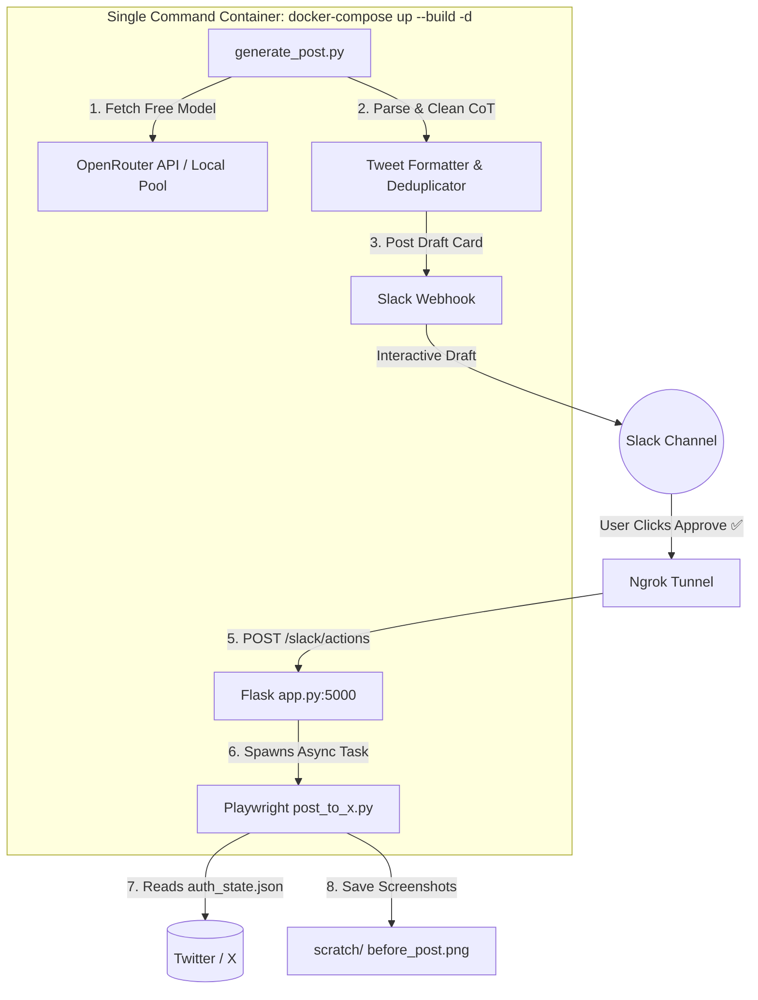

# 🤖 Twitter (X) Automation Engine with AI, Slack & Playwright

[](https://www.python.org/)
[](https://playwright.dev/python/)
[](https://www.docker.com/)
[](https://api.slack.com/block-kit)
[](https://openrouter.ai/)

An end-to-end, automated social media pipeline that generates AI-driven tech/AI tweets via **OpenRouter Free LLMs**, sends interactive approval draft cards (**Approve ✅** / **Reject ❌**) to **Slack**, and automatically posts approved tweets directly to **Twitter (X)** using Playwright headless browser automation—**zero paid Twitter API required!**

---

## ⚡ 1-Command All-in-One Execution

Start **all services** (Flask server, Ngrok public tunnel, scheduled AI tweet generator, and Playwright auto-poster) with a **single command**:

```bash
docker-compose up --build -d
```

### What this single command handles automatically:
1. 🌐 **Flask Webhook Server**: Starts on port `5000` listening for Slack interactive button callbacks.
2. 🔗 **Ngrok Public Tunnel**: Automatically establishes a public tunnel pointing to Flask (`/slack/actions`).
3. 🤖 **AI Tweet Generator Loop**: Runs an initial AI tweet generation immediately on startup and schedules recurring background runs every `GENERATE_INTERVAL_HOURS` (default: 1 hour).
4. 🎭 **Playwright Auto-Poster**: Uses saved `auth_state.json` cookies or `X_AUTH_TOKEN` environment variable to post approved tweets directly to Twitter without manual intervention.

To check live system output and generation logs:
```bash
docker-compose logs -f
```

---

## ✨ Key Features

- 🧠 **AI-Powered Tweet Generation**: Leverages OpenRouter API with dynamic free LLM model selection (`google/gemma-4-31b-it:free`, `minimax/minimax-m3:free`, etc.) across diverse tech & AI topics.
- 🧹 **Chain-of-Thought (CoT) Filtering**: Smart parser automatically strips out internal LLM reasoning/thinking tags (`<think>...`) and extracts clean, 280-character ready-to-post tweets with hashtags.
- 🛡️ **Duplicate Prevention**: Keeps persistent history (`posted_history.json`) to guarantee no repeat tweets are generated or posted.
- 💬 **Interactive Slack Approval Workflow**: Sends rich Slack Block Kit cards with one-click **Approve ✅** and **Reject ❌** buttons.
- 🌐 **Seamless Tunneling**: Integrated **Ngrok** tunnel exposes the Flask webhook endpoint for Slack interactive button callbacks without manual port forwarding.
- 🎭 **Zero-API Twitter Posting**: Uses Playwright Chromium with saved session state (`auth_state.json`) or cookie injection (`X_AUTH_TOKEN`) to bypass expensive API pricing.
- 🐳 **1-Command Container Setup**: Bundles all components into Docker Compose so everything launches in unison.
- ⏱️ **Flexible Linux Systemd Setup**: Optional systemd service and timer files included for host-native background execution.

---

## 🏗️ Architecture & Workflow



---

## ⚙️ Quick Setup Guide

### Step 1: Environment Configuration

Create `.env` file from `.env.example`:

```bash
cp .env.example .env
```

Set your credentials in `.env`:

```env
SLACK_WEBHOOK_URL="https://hooks.slack.com/services/YOUR/WEBHOOK/URL"
NGROK_DOMAIN="your-ngrok-domain.ngrok-free.dev"
NGROK_AUTHTOKEN="your_ngrok_authtoken"
GENERATE_INTERVAL_HOURS=1
OPENROUTER_API_KEY="your_openrouter_api_key_here"
```

---

### Step 2: One-Time Twitter Authentication

Save your login session so Docker can post automatically:

**Option A (Recommended)**: Run `login_x.py` once on your host:
```bash
python3 -m venv venv
./venv/bin/pip install -r requirements.txt
./venv/bin/python login_x.py
```
> Log into Twitter in the opened browser window and press **Enter** in your terminal. This saves your session into `auth_state.json`, which Docker mounts automatically.

**Option B**: Pass `X_AUTH_TOKEN` in `.env`:
```env
X_AUTH_TOKEN="your_auth_token_cookie_here"
```

---

### Step 3: Launch Everything! (1 Command)

Start all services with Docker:

```bash
docker-compose up --build -d
```

That's it! Everything is running:
- Webhook Server listening on `http://localhost:5000/slack/actions`
- Ngrok Public Tunnel active
- Tweet draft generated and sent to Slack immediately!

---

## 🛠️ Management Commands Reference

| Action | Command | Description |
| :--- | :--- | :--- |
| **Start Everything** | `docker-compose up --build -d` | Launches Flask, Ngrok, Generator, and Playwright poster in 1 command |
| **Stop Everything** | `docker-compose down` | Gracefully stops all container services |
| **View Live Logs** | `docker-compose logs -f` | Streams real-time container output for all services |
| **Manual Draft Generation** | `./venv/bin/python generate_post.py` | Triggers immediate draft generation outside schedule |
| **One-Time Login Helper** | `./venv/bin/python login_x.py` | Authenticates and exports `auth_state.json` |

---

## 🔍 Verification & Diagnostics

During every posting attempt, the system automatically captures step-by-step full-page screenshots stored in the [scratch/](file:///home/ravi/Desktop/Study%20Material/Projects/Personal/twitter-automation/scratch) directory:
- `scratch/before_post.png`: Captures the tweet in the compose box prior to clicking Post.
- `scratch/after_post.png`: Captures the published status after posting.
- `scratch/not_logged_in.png`: Generated if Twitter session expired or authentication is needed.

---

## 📂 Project Structure

```text
twitter-automation/
├── app.py                  # Flask server handling Slack interactive button actions (/slack/actions)
├── generate_post.py        # AI tweet generator with OpenRouter dynamic models & CoT cleaning
├── post_to_x.py            # Playwright browser automation script for posting to Twitter (X)
├── send_to_slack.py        # Slack Block Kit message builder and webhook caller
├── login_x.py              # Interactive utility to log into Twitter and export auth_state.json
├── auth_state.json         # Saved browser cookies for headless Playwright sessions
├── posted_history.json     # Saved history of posted tweets to prevent duplicates
├── Dockerfile              # Playwright + Ngrok + Python base Docker image
├── docker-compose.yml      # Docker Compose configuration for 1-command startup
├── docker-entrypoint.sh    # Multi-service entrypoint script (Flask + Ngrok + generator loop)
├── setup_systemd.sh        # Installer script for Linux systemd user timers
├── run_services.sh         # Native host service runner script
├── run_generator.sh        # Native host generator runner script
├── .env.example            # Environment variable template
├── systemd/                # Systemd service and timer unit files
└── scratch/                # Automatic diagnostic screenshots (before_post, after_post, errors)
```

---

## 📄 License

Distributed under the MIT License. See `LICENSE` for details.
