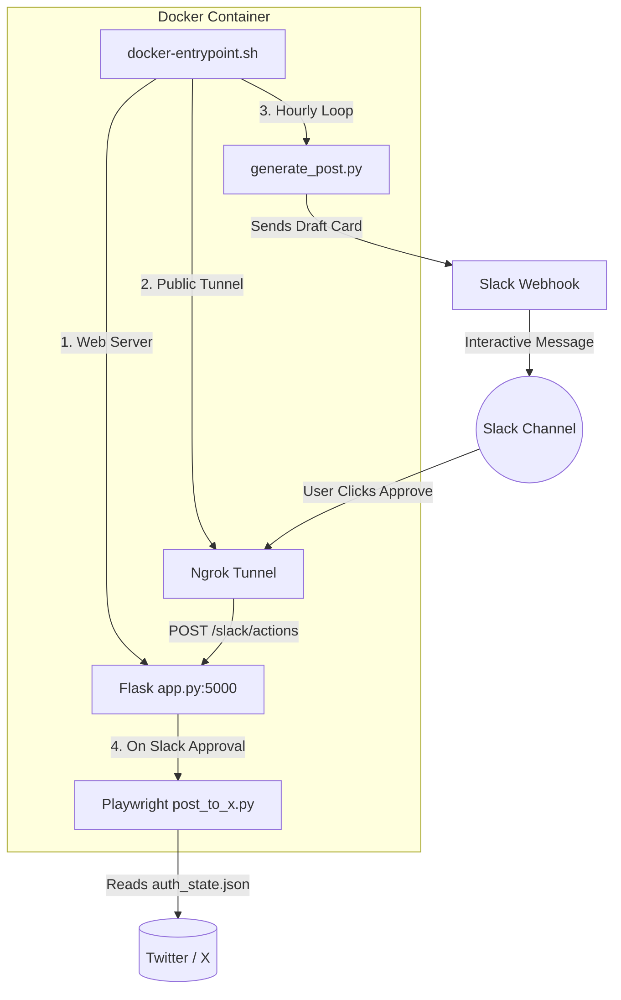

# 🤖 Twitter (X) Automation with Slack & Docker

An easy, automated pipeline that creates tweet drafts, sends interactive draft cards to Slack for your approval (**Approve ✅** / **Reject ❌**), and automatically posts approved tweets to Twitter (X) using Playwright inside Docker—no paid Twitter API required.

---

## 🚀 Quick Start with Docker (1 Command)

Run all services (Flask webhook server, Ngrok tunnel, Playwright poster, and hourly generator loop) with **just one command**:

```bash
docker-compose up --build
```

### What this command does:
1. Starts the **Flask Webhook Server** on port `5000`.
2. Starts the **Ngrok Tunnel** for public Slack callbacks.
3. Schedules post generation every **1 hour** (and generates a draft immediately on startup).
4. Automatically uses your Twitter login cookies from `auth_state.json` to post approved tweets.

---

## 🏗️ How It Works



---

## ⚙️ Step-by-Step Setup Guide

### Step 1: Clone & Configure `.env`

Create a `.env` file in the project folder:

```env
SLACK_WEBHOOK_URL="https://hooks.slack.com/services/YOUR/WEBHOOK/URL"
NGROK_DOMAIN="your-ngrok-domain.ngrok-free.dev"
NGROK_AUTHTOKEN="your_ngrok_authtoken"
GENERATE_INTERVAL_HOURS=1
```

---

### Step 2: One-Time Twitter Login

To let Playwright post on your behalf without paying for the Twitter API, save your login session once:

**Option A (Recommended)**: Run `login_x.py` on your computer:
```bash
python3 -m venv venv
./venv/bin/pip install -r requirements.txt
./venv/bin/python login_x.py
```
> A browser window will open. Log into your X (Twitter) account, then press **Enter** in your terminal.
> This saves your authenticated session to `auth_state.json`, which Docker mounts automatically.

**Option B**: Set your `auth_token` in `.env`:
If you know your `auth_token` cookie value from Chrome Developer Tools:
```env
X_AUTH_TOKEN="your_auth_token_here"
```

---

### Step 3: Run the Application!

Start everything with Docker:

```bash
docker-compose up --build
```

You will see:
- Flask Webhook Server running on port `5000`
- Ngrok Tunnel live on your domain
- Initial draft tweet generated and sent to Slack!

---

## ⚡ Useful Commands

| Action | Command | Description |
| :--- | :--- | :--- |
| **Start Everything** | `docker-compose up --build` | Starts all services in foreground |
| **Run in Background** | `docker-compose up -d` | Runs everything silently in background |
| **One-Time Login** | `./venv/bin/python login_x.py` | Saves Twitter login cookies to `auth_state.json` |
| **View Live Logs** | `docker-compose logs -f` | Streams live logs from Docker container |
| **Stop Container** | `docker-compose down` | Stops all container services |

---

## 📂 Project Structure

```text
twitter-automation/
├── Dockerfile              # Docker container build script (Playwright + Ngrok + Python)
├── docker-compose.yml      # Single command container configuration
├── docker-entrypoint.sh    # Container entrypoint (Flask + Ngrok + periodic generator)
├── .env                    # Environment credentials (Slack webhook, Ngrok tokens)
├── app.py                  # Flask server receiving Slack button callbacks
├── generate_post.py        # Post generator & deduplication logic
├── send_to_slack.py        # Sends interactive Slack draft cards with buttons
├── post_to_x.py            # Playwright headless browser script to post tweets
├── login_x.py              # Interactive helper to log in and export auth_state.json
├── auth_state.json         # Saved Twitter cookies for headless browsing
├── posted_history.json     # Saved history of past tweets to prevent duplicates
├── video_script.md         # Video recording guide & demo script
└── scratch/                # Diagnostic screenshots (before/after post verification)
```
